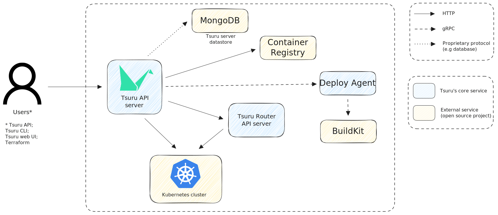

# Architecture

!!! tip "How can I improve the above diagram?"

    Feel free to help us by improving and keeping the above diagram up to date.
    It was created using Excalidraw's whiteboard.
    Click [here][Arch diagram link] to access the most updated version available.
    After changing anything, you should share the new export link with us.

## Tsuru API server

<small>This service is part of Tsuru's core services.</small>

The web API where the Tsuru users interact with.
It's responsible for almost everything since Tsuru workloads[^1] creation until deployment workflow and troubleshooting operations.

| | |
|-|-|
| Source code: | :simple-github: [tsuru/tsuru](https://github.com/tsuru/tsuru) |
| OpenAPI specification: | :simple-swagger: [Tsuru API][SwaggerHub - Tsuru API] |

## MongoDB

The datastore service used by Tsuru API server to store the Tsuru workloads[^1] expected state, events and so on.
Currently, it must a [MongoDB] server implementation on 4.x version.

| | |
|-|-|
| Source code: | :simple-github: [mongodb/mongo] |

## Container Registry

Service to store and distribute container images of Tsuru workloads[^1].
It must be compliant with [Docker Registry API][Docker registry] or [OCI distribution specification][OCI distribution spec].

| | |
|-|-|
| Source code: | :simple-github: [distribution/distribution] |

## Deploy Agent

<small>This service is part of Tsuru's core services.</small>

The service is responsible for intermediating the build and push process of Tsuru workloads[^1] container images to the container registry.

| | |
|-|-|
| Source code: | :simple-github: [tsuru/deploy-agent] |

## BuildKit

Service to build and push container images from a container file recipe.

| | |
|-|-|
| Source code: | :simple-github: [moby/buildkit] |

## Tsuru Router API

<small>This service is part of Tsuru's core services.</small>

The web API service which Tsuru updates the app's service backend.

| | |
|-|-|
| Source code: | :simple-github: [tsuru/kubernetes-router] |
| OpenAPI specification: | :simple-swagger: [Tsuru Router API][SwaggerHub - Tsuru Router API] |

## Kubernetes cluster

The [Kubernetes] cluster where Tsuru API should run the Tsuru workloads[^1] on.

| | |
|-|-|
| Source code: | :simple-github: [kubernetes/kubernetes] |

[^1]: Tsuru apps and jobs

[Arch diagram link]: https://excalidraw.com/#json=82LzV5xb0cOcKAEjYFXLK,rRJ14gZdbHKrlYSmFG_rFw
[SwaggerHub - Tsuru API]: https://app.swaggerhub.com/apis/tsuru/tsuru/
[SwaggerHub - Tsuru Router API]: https://app.swaggerhub.com/apis/tsuru/tsuru-router_api/
[MongoDB]: https://www.mongodb.com/
[Docker registry]: https://docs.docker.com/registry/
[OCI distribution spec]: https://github.com/opencontainers/distribution-spec
[Kubernetes]: https://kubernetes.io/

[mongodb/mongo]: https://github.com/distribution/distribution
[distribution/distribution]: https://github.com/distribution/distribution
[tsuru/deploy-agent]: https://github.com/tsuru/deploy-agent
[moby/buildkit]: https://github.com/moby/buildkit
[tsuru/kubernetes-router]: https://github.com/tsuru/kubernetes-router
[kubernetes/kubernetes]: https://github.com/kubernetes/kubernetes
